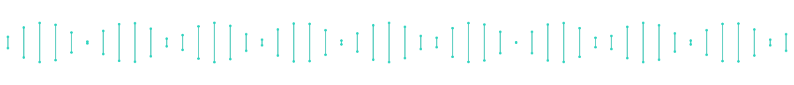

  

  
  &nbsp;&nbsp;&nbsp;
  
  &nbsp;&nbsp;&nbsp;
  

 

### Focus

Cellular target engagement &nbsp;·&nbsp; biophysical assay development &nbsp;·&nbsp; targeted protein degradation &nbsp;·&nbsp; chemical probe design for the understudied proteome

### Selected publications

1. Scholes NS, … **Schwalm MP**, … Winter GE. [Inhibitors supercharge kinase turnover through native proteolytic circuits](https://doi.org/10.1038/s41586-025-09763-9). *Nature* 649, 1032–1041 (2026).
2. **Schwalm MP**, Knapp S. [Single-plate kinome screening in live-cells to enable highly cost-efficient kinase inhibitor profiling](https://doi.org/10.1016/j.slasd.2025.100214). *SLAS Discovery* 31, 100214 (2025).
3. **Schwalm MP**, Menge A, Elson L, Greco FA, Robers MB, Müller S, Knapp S. [Functional characterization of pathway inhibitors for the ubiquitin-proteasome system (UPS) as tool compounds for CRBN and VHL-mediated targeted protein degradation](https://doi.org/10.1021/acschembio.4c00450). *ACS Chem. Biol.* 20, 94–104 (2025).
4. Dopfer J, Vasta JD, Müller S, Knapp S, Robers MB, **Schwalm MP**. [tracerDB: a crowdsourced fluorescent tracer database for target engagement analysis](https://doi.org/10.1038/s41467-024-49896-5). *Nat. Commun.* 15, 5646 (2024).
5. **Schwalm MP**, Saxena K, Müller S, Knapp S. [Luciferase- and HaloTag-based reporter assays to measure small-molecule-induced degradation pathway in living cells](https://doi.org/10.1038/s41596-024-00979-z). *Nat. Protoc.* 19, 2317–2357 (2024).
6. **Schwalm MP**, Krämer A, Dölle A, Weckesser J, Yu X, Jin J, Saxena K, Knapp S. [Tracking the PROTAC degradation pathway in living cells highlights the importance of ternary complex measurement for PROTAC optimization](https://doi.org/10.1016/j.chembiol.2023.06.002). *Cell Chem. Biol.* 30, 753–765 (2023).
7. Nemec V, **Schwalm MP**, Müller S, Knapp S. [PROTAC degraders as chemical probes for studying target biology and target validation](https://doi.org/10.1039/D2CS00478J). *Chem. Soc. Rev.* 51, 7971–7993 (2022).

Full list: [ORCID](https://orcid.org/0000-0002-1252-1829) &nbsp;·&nbsp; [Google Scholar](https://scholar.google.com/citations?user=jOQsOzoAAAAJ&hl=en)

### Open work

**[tracerDB](https://tracerdb.org)** &mdash; an open-access database of fluorescent tracers for target engagement assays.

<!-- =========================================================================
     FEATURED REPOSITORIES  (prepared — uncomment when you have public repos)

     Delete this comment wrapper and fill one line per repo. Keep it short.

### Featured repositories

- **[repo-name](https://github.com/USER/repo-name)** — one-line description of what it does.
- **[repo-name](https://github.com/USER/repo-name)** — one-line description of what it does.

     ========================================================================= -->

 

  

<!--
Setup notes, delete before publishing:
- Renders on your profile only if the repo is named exactly like your GitHub username.
- Commit the whole assets/ folder (header-helix.svg, footer.svg, icons/) with this file, keeping relative paths.
- Everything here is public-tier.
- See CLAUDE.md for how to update this profile (publications, repos, animations) later.
-->
